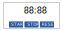

# TEST DRIVEN DEVELOPMENT: REACT TIMER APP

## Epic and User Story

<table>
    <thead>
        <tr>
            <th>Epic</th>
            <th>User Story</th>
            <th>Acceptance Criteria</th>
        </tr>
    </thead>
    <tbody>
      <tr>
        <td rowspan=3>Develop a Timer App</td>
        <td rowspan=1>Start timer to initiate count down</td>
        <td>
          User is able to:
          <ul>
            <li>start the timer</li>
            <li>see the timer countdown</li>
          </ul>
          Counting down the time should not be interrupted even if the user clicks the start button more than once.        
        </td>
      </tr>
      <tr>
        <td>
          Stop/Pause the timer so that countdown is applied only when needed
        </td>
        <td>
          User is able to:
          <ul>
            <li>stop the timer</li>
            <li>see the timer stopped</li>
          </ul>
          Once the timer is stopped, nothing should happen when the user clicks the stop button again
        </td>
      </tr>
      <tr>
        <td>
          Reset the timer so that countdown can begin from start
        </td>
        <td>
          User is able to:
          <ul>
            <li>reset the timer</li>
            <li>see the timer reset to default</li>
          </ul>
        </td>
      </tr>
    </tbody>
</table>

## Wireframe

  

